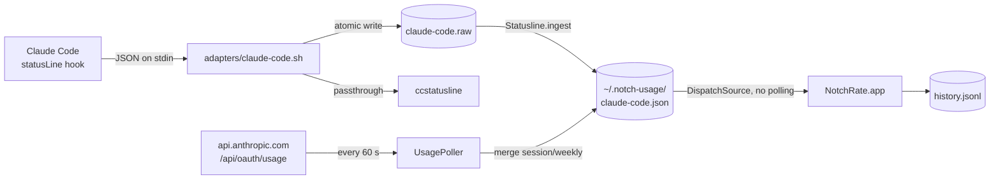

<p align="center">
  
</p>

<p align="center">
  <a href="https://github.com/settivishal/NotchRate/releases"></a>
  <a href="https://github.com/settivishal/NotchRate/actions/workflows/ci.yml"></a>
  
  
  <a href="LICENSE"></a>
  <a href="https://github.com/settivishal/NotchRate/stargazers"></a>
</p>

<p align="center">
  <a href="#what-you-get">What you get</a> ·
  <a href="#install">Install</a> ·
  <a href="#how-it-works">How it works</a> ·
  <a href="#settings">Settings</a> ·
  <a href="#privacy">Privacy</a> ·
  <a href="#development">Development</a> ·
  <a href="CONTRIBUTING.md">Contributing</a> ·
  <a href="LICENSE">License</a>
</p>

---

**NotchRate** is a native macOS utility that lives in the MacBook notch. Its first module shows how much of your Claude **session (5h)** and **weekly (7d)** limits you have used; hover for detail, swipe or tap between categories for more tools (Caffeinate, Claude Code approvals). Near-zero idle CPU, no Electron.

Pro and Max limits are shared across Claude Code, claude.ai chat and Cowork, so the badge reflects all of them — not just the terminal.

## What you get

Collapsed: dot + session %, merged with the notch (a pill at the top of the menu bar on external displays). Hover for the card:

| Tab · Page | What it shows |
|---|---|
| **Claude · Overview** | Session and weekly ring gauges (or bars) with reset countdowns, CLI cost, context window %, extra-usage % when enabled, refresh, pin, link to claude.ai usage |
| **Claude · Trends** | 5h and 7d charts, burn rate, "full in ~Xh", usage this window, today's / average daily usage, projected weekly at reset |
| **Claude · Week** | Per-day bars of weekly limit consumed, sessions started, peak session %, limit hits, CLI cost for the week |
| **Caffeinate** | Keep the Mac awake for 30m / 1h / 2h / until turned off; auto-off when the timer ends; a countdown blob sits beside the badge while awake |
| **Focus** | Pomodoro timer: 15m / 25m / 45m / 1h, countdown blob while running, notification when it ends |

The icon bar under the notch (or a two-finger swipe) switches categories; pills in the header move between a category's pages.

### Agent approvals

### Side blobs

Activity shows as small circles beside the badge, iOS Dynamic Island style: they pop out of the notch, melt back into it when the card opens, and sit on either side (Caffeinate on one, Claude Code on the other; pick the side in Settings).

- **Working** — a pulsing sparkle while Claude Code is answering a prompt.
- **Limit hit** — a red hourglass draining toward the reset while a bucket sits at 100 %.
- **Done** — a green check when it finishes; stays until you bring a terminal to the front (iTerm, Terminal, Ghostty, Warp, kitty, Alacritty, WezTerm, VS Code, Cursor) or click it.
- **Approval** — when Claude Code stops for a permission, a shield with a countdown ring appears and hovering opens the **Allow / Deny** page; the answer goes straight back through the `PermissionRequest` hook. When Claude presents a plan, read it and pick the same options the terminal offers: **Auto-accept edits**, **Ask on edits** or **Keep planning**. Tool prompts wait 15 s on the notch, plans 90 s; after that the blob greys out, the usual terminal prompt appears and the blob clears itself once you answer there.

All of it is wired by **Connect Claude Code status line…** (adds `hooks` entries next to `statusLine` in `~/.claude/settings.json`).

Badge colors: green under 60 %, yellow 60–85 %, red above. Greyed out ("offline") when no update arrives for 2 h. Notifications fire when session or weekly usage crosses 85 % and 100 %.

## Install

**Requirements:** macOS 26+, Apple Silicon, a Claude Pro/Max subscription (rate limits are only reported for those), Claude Code.

**Download** — grab `NotchRate-vX.Y.Z.zip` from the [latest release](https://github.com/settivishal/NotchRate/releases/latest), unzip, move `NotchRate.app` to `/Applications`. The build is ad-hoc signed, so on first launch right-click → Open (or `xattr -d com.apple.quarantine /Applications/NotchRate.app`). Session/weekly % show up within a minute. For CLI cost and context data, click the menu bar icon → **Connect Claude Code status line…**, then restart Claude Code.

**Build from source** — needs Xcode.

```sh
git clone https://github.com/settivishal/NotchRate.git
cd NotchRate
make install
```

**Connect** copies the bundled status-line adapter to `~/.notch-usage/bin/` and points `statusLine.command` in `~/.claude/settings.json` at it (backup in `settings.json.bak`). The app refreshes the adapter on launch when a release changes it.

Using a status line other than `ccstatusline`? Set `NOTCH_DOWNSTREAM` at the top of `~/.notch-usage/bin/claude-code.sh`.

**Uninstall:** quit the app, delete `/Applications/NotchRate.app` and `~/.notch-usage/`, restore `~/.claude/settings.json.bak`.

## How it works



Two data sources feed one normalized file:

1. **Status line** — Claude Code runs a script after every turn with `rate_limits`, `cost` and `context_window`. The adapter normalizes it and chains to your existing status line, so the terminal is unchanged.
2. **OAuth usage endpoint** — while the CLI is idle, the app polls Anthropic's usage endpoint with Claude Code's own token, so chat and Cowork usage show up too. The token is refreshed when it expires and written back to the Keychain the same way Claude Code does.

The app watches `~/.notch-usage/` with a filesystem event source and re-renders on change. Any tool can join by writing its own `<tool>.json` in this shape:

```json
{
  "tool": "claude-code",
  "session_used_pct": 42, "session_resets_at": 1757900000,
  "weekly_used_pct": 18,  "weekly_resets_at": 1758200000,
  "cost_usd": 1.23, "context_pct": 37, "extra_pct": null,
  "models": { "opus": { "pct": 40, "resets_at": 1758200000 } },
  "last_updated": 1757850000
}
```

Every change is appended to `~/.notch-usage/history.jsonl` (8 days kept) to drive the Trends and Week pages.

## Settings

Menu bar gauge icon → **Settings…**

| Setting | Default | Notes |
|---|---|---|
| Launch at login | off | `SMAppService`, survives `make clean` because the app lives in `/Applications` |
| Global hotkey ⌃⌥N | on | Opens the card pinned on the screen under the mouse; again closes |
| Usage text in menu bar | off | `5h 42% · 7d 13%` instead of the gauge icon |
| Hide badge | off | Menu bar item only |
| Show weekly in badge | off | `5h 42%` / `7d 13%`, label colored instead of the dot |
| Time to reset instead of % | off | Badge shows `2h 13m` |
| Ring instead of dot | off | 10 pt arc of session usage |
| Expanded gauges | rings | Rings or bars on the Overview page |
| Follow mouse to every display | on | Off = notch screen only; plain displays get a pill |
| Hover delay | 0.3 s | 0–1 s |
| Badge width beside notch | 44 pt | 30–120 pt |
| Card corner radius | 28 pt | 8–48 pt, previews live while dragging |
| Poll usage every | 60 s | 30 s – 10 min |
| Mark offline after | 2 h | 0.5–12 h without an update |
| Warn at / Alert at | 85 % / 100 % | Notification thresholds per bucket |
| Pace warning | on | Once per session window when the burn rate reaches 100 % before reset |
| Timer blobs on the left | off | Swaps the sides of the timer (Caffeinate, Focus) and Claude Code blobs |
| Notify when a limit resets | on | After a bucket passed the first threshold and rolled over |
| Allow/Deny on the notch | on | Permission prompts appear as a blob for 15 s before the terminal takes over |
| Plans on the notch | on | Notification + approve/keep-planning from the card when Claude Code presents a plan |

## Privacy

- **Network:** one `GET` to `api.anthropic.com/api/oauth/usage` per poll interval, plus a token refresh `POST` to `console.anthropic.com` when the token has expired. Nothing else. No telemetry, no third-party servers.
- **Keychain:** reads the `Claude Code-credentials` item via the `security` CLI (already on that item's ACL, so no prompt). Writes back only after a token refresh, preserving every other field.
- **Disk:** `~/.notch-usage/` holds the normalized snapshot and the history log. Both are plain JSON you can delete at any time.
- **Endpoint stability:** the OAuth usage endpoint is undocumented; if it changes, the badge falls back to status-line data and goes "offline" between CLI turns.

See [SECURITY.md](SECURITY.md) for reporting.

## Development

```sh
make run      # build to build/NotchRate.app and launch
make test     # swift-testing unit tests
bash adapters/test.sh   # adapter self-check
```

Needs Xcode (the macOS 27 SDK's SwiftUI macros ship only with it); `swift build` and `Package.swift` work directly.

| File | Role |
|---|---|
| `adapters/claude-code.sh` | statusLine wrapper, dumps raw JSON, passes through |
| `NotchRate/Statusline.swift` | normalizes the raw dump, installs adapter + patches `~/.claude/settings.json` |
| `NotchRate/UsageStore.swift` | watches `~/.notch-usage`, decodes snapshots |
| `NotchRate/UsagePoller.swift` | polls the OAuth usage endpoint, refreshes the token |
| `NotchRate/History.swift` | history log, week and trend stats |
| `NotchRate/NotchGeometry.swift` | per-screen notch/pill sizing |
| `NotchRate/NotchView.swift` | collapsed badge, Overview / Trends / Week pages |
| `NotchRate/ScreenTracker.swift` | which display hosts the badge |
| `NotchRate/Notifier.swift` | 85 % / 100 % notifications |
| `NotchRate/Settings.swift` | preferences and Settings window |

## Roadmap

- Adapters for Codex CLI, Cursor, Copilot
- Signed, notarized builds and a Homebrew cask

## License

[MIT](LICENSE). The notch geometry is inspired by [DynamicNotchKit](https://github.com/MrKai77/DynamicNotchKit) (MIT); [boringNotch](https://github.com/TheBoredTeam/boring.notch) was used as a read-only reference.
